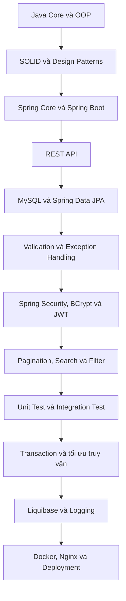
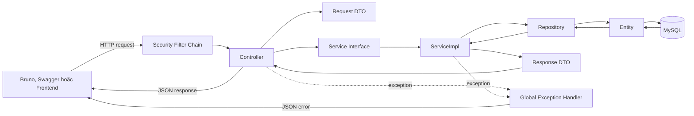
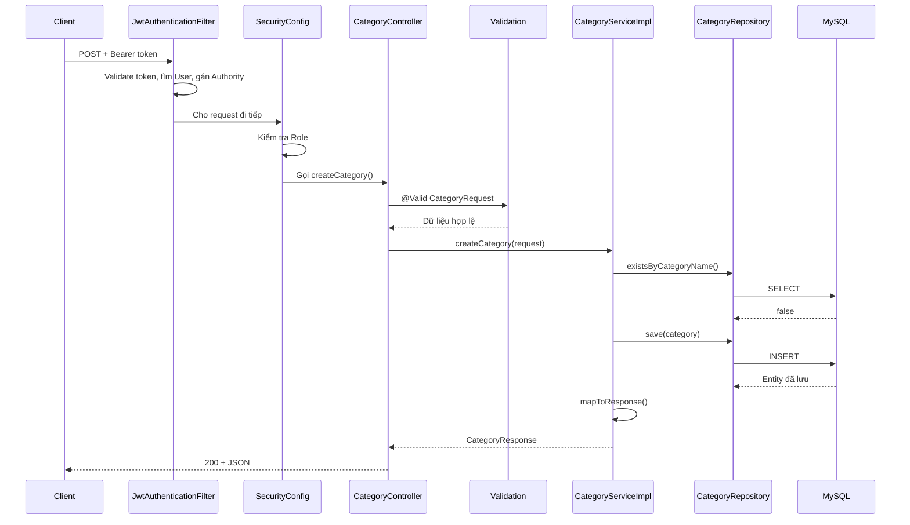
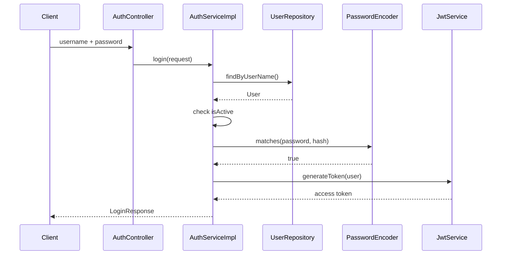
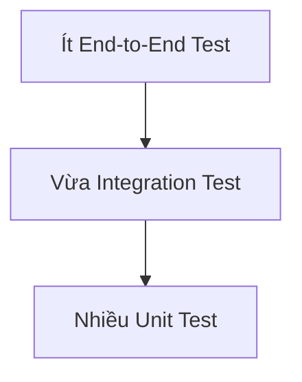
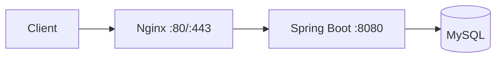
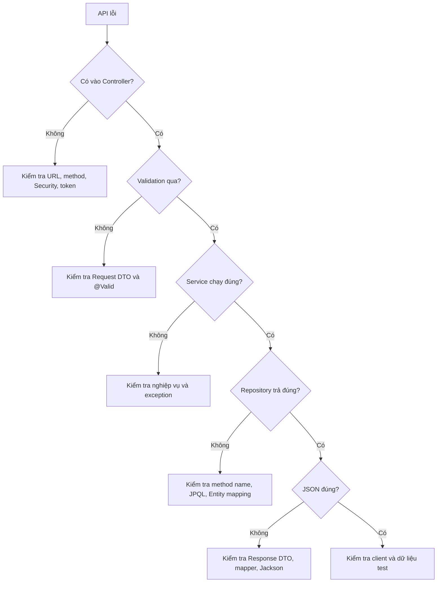
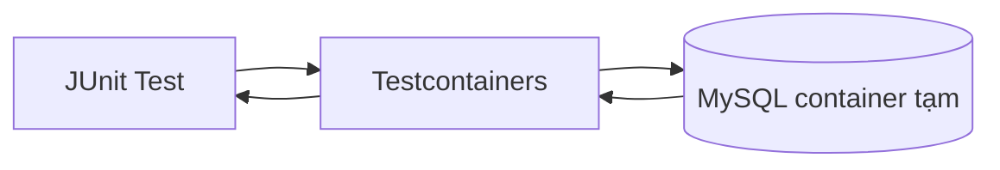

# CẨM NANG HỌC BACKEND QUA SUPERMARKET API

Tài liệu này là bản đồ tổng hợp những kiến thức Backend đang được áp dụng trong
Supermarket API. Mục tiêu không chỉ là biết đoạn code nào cần viết, mà còn hiểu:

- Vì sao cần tách code thành nhiều tầng.
- Một HTTP request đi qua những file nào.
- OOP, SOLID và Design Pattern xuất hiện ở đâu trong project.
- Spring Boot, JPA, Security, JWT và Validation phối hợp với nhau thế nào.
- Phần nào đã học, phần nào đang luyện và phần nào nên học tiếp.

Tài liệu đào sâu liên quan:

- [Bản đồ kiến trúc project](PROJECT_ARCHITECTURE_GUIDE.md)
- [Luồng xác thực JWT](JWT_AUTH_FLOW.md)
- [Danh sách công việc còn lại](PROJECT_REMAINING_TASKS.md)
- [Kế hoạch đào tạo Backend](BE_Training_Plan_v1_1.md)

---

## 1. Bản đồ học Backend tổng thể



### Trạng thái hiện tại

| Nhóm kiến thức | Trạng thái | Ghi chú |
|---|---|---|
| Java OOP cơ bản | Đã học, cần luyện thêm | Class, interface, đóng gói, abstraction |
| Spring Boot và REST API | Đã thực hành | Controller, Service, Repository, CRUD |
| DTO request/response | Đã thực hành | Đang hoàn thiện cho toàn bộ module |
| MySQL và JPA | Đã thực hành cơ bản | Entity, Repository, khóa ngoại, JPQL |
| Validation | Đã thực hành | `@Valid`, `@NotBlank`, `@Email`, giới hạn số |
| Exception handling | Đã thực hành | Custom exception, `@RestControllerAdvice` |
| Spring Security và JWT | Đã thực hành | Login, filter, role, 401, 403 |
| Pagination, sort, search, filter | Đã thực hành | Cần bổ sung validate tham số |
| JUnit và Mockito | Đang học | Đã có unit test và integration test đầu tiên |
| Transaction, Auditing | Chưa học sâu | Nên học tiếp sau test |
| Tối ưu truy vấn, N+1 | Chưa học sâu | Quan trọng khi dữ liệu lớn |
| Refresh token | Chưa làm | Là bước nâng cấp của JWT |
| Liquibase | Chưa làm | Quản lý phiên bản database |
| Logging | Chưa làm đầy đủ | Cần cho debug và production |
| Docker, Nginx, deployment | Chưa làm | Giai đoạn đóng gói và triển khai |

---

## 2. Bức tranh kiến trúc của ứng dụng

Backend hiện tại đi theo kiến trúc phân tầng:



Ý nghĩa chính:

- Client không truy cập database trực tiếp.
- Controller không tự viết câu truy vấn.
- Repository không quyết định nghiệp vụ.
- Entity không được dùng làm request tùy ý.
- Response DTO kiểm soát dữ liệu được trả ra ngoài.
- Exception được xử lý tập trung để response lỗi thống nhất.

---

## 3. Cấu trúc thư mục

```text
src/main/java/com/api/supermarket/
├── config/
│   ├── SecurityConfig.java
│   └── JacksonConfig.java
├── controller/
│   ├── AuthController.java
│   ├── CategoryController.java
│   ├── ProductController.java
│   ├── RoleController.java
│   ├── SupplierController.java
│   └── UserController.java
├── dto/
│   ├── request/
│   │   ├── LoginRequest.java
│   │   ├── CategoryRequest.java
│   │   └── ...
│   └── response/
│       ├── LoginResponse.java
│       ├── CategoryResponse.java
│       ├── PageResponse.java
│       └── ...
├── entity/
│   ├── Category.java
│   ├── Product.java
│   ├── Role.java
│   ├── Supplier.java
│   └── User.java
├── exception/
│   ├── BadRequestException.java
│   ├── ResourceNotFoundException.java
│   ├── UnauthorizedException.java
│   └── GlobalExceptionHandler.java
├── repository/
│   ├── CategoryRepository.java
│   └── ...
├── security/
│   ├── JwtService.java
│   ├── JwtAuthenticationFilter.java
│   ├── JwtAuthenticationEntryPoint.java
│   └── JwtAccessDeniedHandler.java
├── service/
│   ├── CategoryService.java
│   └── Impl/
│       └── CategoryServiceImpl.java
└── SupermarketApplication.java
```

### Vì sao phải chia package?

Mỗi package có một trách nhiệm:

| Package | Trách nhiệm |
|---|---|
| `controller` | Nhận HTTP request và trả HTTP response |
| `dto/request` | Định nghĩa dữ liệu client được phép gửi |
| `dto/response` | Định nghĩa dữ liệu client được phép nhận |
| `service` | Khai báo hợp đồng nghiệp vụ |
| `service/Impl` | Cài đặt nghiệp vụ |
| `repository` | Truy cập database |
| `entity` | Ánh xạ object Java với bảng |
| `security` | Xác thực token và thiết lập người dùng đăng nhập |
| `exception` | Biểu diễn và xử lý lỗi |
| `config` | Khai báo Bean và cấu hình framework |

Việc chia nhỏ không nhằm làm project dài hơn. Nó giúp thay đổi một phần mà ít
ảnh hưởng phần khác, dễ test và dễ tìm lỗi.

---

## 4. Luồng một API chạy như thế nào?

Ví dụ:

```http
POST /api/categories
Authorization: Bearer <token>
Content-Type: application/json

{
  "categoryName": "Đồ uống",
  "description": "Các loại nước",
  "isActive": true
}
```



Nếu có lỗi:

```text
Validation sai
    -> MethodArgumentNotValidException
    -> GlobalExceptionHandler
    -> HTTP 400

Không tìm thấy dữ liệu
    -> ResourceNotFoundException
    -> GlobalExceptionHandler
    -> HTTP 404

Token thiếu hoặc không hợp lệ
    -> JwtAuthenticationEntryPoint
    -> HTTP 401

Đăng nhập rồi nhưng sai Role
    -> JwtAccessDeniedHandler
    -> HTTP 403
```

---

## 5. OOP đang xuất hiện ở đâu?

### 5.1 Class và object

`Category`, `CategoryRequest`, `CategoryResponse` đều là class. Khi chạy:

```java
Category category = new Category();
```

`Category` là khuôn mẫu, còn `category` là object được tạo từ khuôn mẫu đó.

### 5.2 Encapsulation - đóng gói

Field thường để `private`:

```java
private String categoryName;
```

Code bên ngoài truy cập qua getter/setter. Điều này giúp class kiểm soát trạng
thái của chính nó thay vì cho mọi nơi sửa field trực tiếp.

### 5.3 Abstraction - trừu tượng

Controller chỉ biết `CategoryService`:

```java
private final CategoryService categoryService;
```

Controller không cần biết Service đang dùng JPA, JDBC hay gọi một hệ thống khác.
Chi tiết nằm trong `CategoryServiceImpl`.

### 5.4 Interface và implementation

```java
public interface CategoryService {
    CategoryResponse getCategoryById(Long id);
}
```

```java
public class CategoryServiceImpl implements CategoryService {
    // Cài đặt cụ thể
}
```

Interface là hợp đồng; implementation là cách thực hiện hợp đồng.

### 5.5 Polymorphism - đa hình

Biến có kiểu `CategoryService` có thể nhận bất kỳ implementation nào tuân thủ
interface đó. Đây là cơ sở để thay implementation hoặc truyền mock khi test.

### 5.6 Inheritance - kế thừa

Project dùng kế thừa qua framework, ví dụ:

```java
public class JwtAuthenticationFilter extends OncePerRequestFilter
```

Filter kế thừa hành vi nền rồi override phần xử lý cần thiết.

---

## 6. SOLID và cách áp dụng

SOLID là năm nguyên tắc giúp code dễ thay đổi, dễ test và ít phụ thuộc cứng.

### 6.1 S - Single Responsibility Principle

Một class nên có một lý do chính để thay đổi.

Trong project:

- Controller thay đổi khi API contract thay đổi.
- ServiceImpl thay đổi khi nghiệp vụ thay đổi.
- Repository thay đổi khi cách truy vấn thay đổi.
- Mapper thay đổi khi response thay đổi.

Không nên để Controller vừa nhận request, vừa hash password, vừa truy vấn DB,
vừa tạo JWT.

### 6.2 O - Open/Closed Principle

Code nên mở cho việc mở rộng nhưng hạn chế phải sửa code ổn định.

Ví dụ `PageResponse<T>` dùng generic:

```java
PageResponse<ProductResponse>
PageResponse<CategoryResponse>
PageResponse<SupplierResponse>
```

Không cần tạo lại ba class phân trang khác nhau.

### 6.3 L - Liskov Substitution Principle

Một implementation phải có thể thay thế interface/base type mà không làm sai
hành vi đã cam kết.

Nếu `CategoryService.getCategoryById()` cam kết:

- Có dữ liệu thì trả `CategoryResponse`.
- Không có dữ liệu thì ném `ResourceNotFoundException`.

Mọi implementation khác của `CategoryService` cũng phải giữ quy tắc đó.

### 6.4 I - Interface Segregation Principle

Không nên ép class phụ thuộc vào những method nó không cần.

Project hiện dùng Service riêng cho từng module:

```text
CategoryService
ProductService
SupplierService
UserService
RoleService
```

Điều này hợp lý hơn một interface rất lớn tên `SupermarketService` chứa mọi
nghiệp vụ.

### 6.5 D - Dependency Inversion Principle

Tầng cấp cao nên phụ thuộc abstraction, không phụ thuộc trực tiếp chi tiết.

```java
public CategoryController(CategoryService categoryService) {
    this.categoryService = categoryService;
}
```

Controller phụ thuộc `CategoryService`, không tự:

```java
new CategoryServiceImpl(...)
```

Spring IoC Container chịu trách nhiệm tạo và inject object.

### Ghi nhớ SOLID ngắn gọn

```text
S: Mỗi class một trách nhiệm chính.
O: Mở rộng được mà ít sửa code cũ.
L: Implementation không phá hợp đồng.
I: Interface nhỏ, đúng nhu cầu.
D: Phụ thuộc abstraction và dùng Dependency Injection.
```

---

## 7. Spring Core: IoC, Bean và Dependency Injection

### IoC là gì?

Inversion of Control nghĩa là quyền tạo và quản lý object được giao cho Spring.

Các annotation thường gặp:

```text
@RestController -> Bean nhận request
@Service        -> Bean xử lý nghiệp vụ
@Repository     -> Bean truy cập dữ liệu
@Component      -> Bean tổng quát
@Configuration  -> Class khai báo cấu hình
@Bean           -> Method tạo object do Spring quản lý
```

### Vì sao dùng constructor injection?

```java
public CategoryServiceImpl(
    CategoryRepository categoryRepository,
    ProductRepository productRepository
) {
    this.categoryRepository = categoryRepository;
    this.productRepository = productRepository;
}
```

Lợi ích:

- Dependency được thể hiện rõ.
- Field có thể để `final`.
- Dễ truyền mock trong unit test.
- Không cần tự `new`.
- Class không tồn tại ở trạng thái thiếu dependency.

---

## 8. REST API và HTTP

### HTTP method

| Method | Ý nghĩa | Ví dụ |
|---|---|---|
| GET | Đọc dữ liệu | `GET /api/categories/1` |
| POST | Tạo dữ liệu | `POST /api/categories` |
| PUT | Cập nhật toàn bộ dữ liệu chính | `PUT /api/categories/1` |
| PATCH | Cập nhật một phần | Chưa áp dụng |
| DELETE | Xóa dữ liệu | `DELETE /api/categories/1` |

### Status code cần nhớ

| Code | Ý nghĩa |
|---|---|
| 200 | Request thành công và có response |
| 201 | Tạo mới thành công, nên cân nhắc dùng cho POST |
| 204 | Thành công nhưng không có response body |
| 400 | Dữ liệu gửi lên sai hoặc vi phạm nghiệp vụ |
| 401 | Chưa xác thực hoặc thông tin đăng nhập sai |
| 403 | Đã xác thực nhưng không có quyền |
| 404 | Không tìm thấy tài nguyên |
| 409 | Xung đột dữ liệu, có thể dùng cho dữ liệu trùng |
| 500 | Lỗi không dự đoán được ở server |

### URI nên mô tả tài nguyên

```text
Tốt:
GET    /api/products
GET    /api/products/10
POST   /api/products
PUT    /api/products/10
DELETE /api/products/10

Hạn chế:
GET /api/getAllProducts
POST /api/createProduct
```

---

## 9. DTO, Validation và Mapper

### Vì sao không dùng Entity làm request?

Entity mô tả dữ liệu lưu trong database. Nếu nhận Entity trực tiếp:

- Client có thể gửi `id` hoặc `createdAt` không nên được phép sửa.
- API bị phụ thuộc chặt vào schema database.
- Dễ lộ field nhạy cảm.
- Validation cho create và update khó tách.

### Request DTO

```java
public class LoginRequest {

    @NotBlank(message = "Username không được để trống")
    private String username;

    @NotBlank(message = "Password không được để trống")
    private String password;
}
```

### `@Valid` làm gì?

```java
public LoginResponse login(
    @Valid @RequestBody LoginRequest request
)
```

Thứ tự:

```text
JSON
 -> Jackson chuyển thành LoginRequest
 -> @Valid kiểm tra annotation
 -> hợp lệ mới gọi Controller method/Service
 -> không hợp lệ trả 400 qua GlobalExceptionHandler
```

### Annotation validation thường dùng

| Annotation | Ý nghĩa |
|---|---|
| `@NotNull` | Không được `null` |
| `@NotBlank` | Chuỗi không được null, rỗng hoặc chỉ có khoảng trắng |
| `@NotEmpty` | Collection hoặc chuỗi không được rỗng |
| `@Size` | Giới hạn độ dài hoặc số phần tử |
| `@Email` | Định dạng email |
| `@Min`, `@Max` | Giới hạn số nguyên |
| `@DecimalMin` | Giới hạn số thập phân |
| `@Positive` | Phải lớn hơn 0 |

### Response DTO

Response DTO là hợp đồng JSON gửi cho client. Ví dụ `UserResponse` không nên
chứa `passwordHash`.

### Mapper

```java
private CategoryResponse mapToResponse(Category category) {
    return new CategoryResponse(
        category.getCategoryId(),
        category.getCategoryName(),
        category.getDescription(),
        category.getIsActive(),
        category.getCreateAt()
    );
}
```

Mapper tập trung việc đổi Entity thành DTO. Danh sách được map bằng Stream:

```java
return categories.stream()
    .map(this::mapToResponse)
    .toList();
```

---

## 10. JPA, Entity và Repository

### ORM là gì?

ORM ánh xạ:

```text
Java class  <-> Database table
Java field  <-> Database column
Java object <-> Database row
```

Ví dụ:

```java
@Entity
@Table(name = "categories")
public class Category {

    @Id
    @GeneratedValue(strategy = GenerationType.IDENTITY)
    @Column(name = "category_id")
    private Long categoryId;
}
```

### Repository

```java
public interface CategoryRepository
    extends JpaRepository<Category, Long> {
}
```

`JpaRepository` cung cấp sẵn:

```text
findAll()
findById()
save()
delete()
existsById()
```

### Derived query

Spring phân tích tên method:

```java
boolean existsByCategoryName(String categoryName);
List<Category> findByIsActiveTrue();
List<Category> findByCategoryNameContaining(String keyword);
```

Tên sau `By` phải dựa trên **field trong Entity**, không dựa trực tiếp trên tên
cột MySQL.

### JPQL

```java
SELECT c FROM Category c
WHERE LOWER(c.categoryName) LIKE LOWER(CONCAT('%', :keyword, '%'))
```

JPQL dùng tên Entity và field Java:

```text
Category
categoryName
```

SQL dùng tên bảng và cột:

```text
categories
name
```

### Khóa ngoại và xóa dữ liệu

Trước khi xóa Category/Supplier/Role, Service kiểm tra bản ghi phụ thuộc:

```text
Category có Product -> không xóa, trả 400
Supplier có Product -> không xóa, trả 400
Role có User        -> không xóa, trả 400
```

Đây vừa là bảo vệ nghiệp vụ, vừa tránh lỗi foreign key từ database.

---

## 11. Phân trang, sắp xếp và lọc

Client gửi:

```http
GET /api/categories?page=0&size=10&sortBy=categoryName&sortDir=desc
```

Service tạo:

```java
Sort sort = sortDir.equalsIgnoreCase("desc")
    ? Sort.by(sortBy).descending()
    : Sort.by(sortBy).ascending();

Pageable pageable = PageRequest.of(page, size, sort);
```

Repository trả `Page<Category>`, sau đó Service map content:

```text
Page<Category>
 -> getContent()
 -> Stream map
 -> List<CategoryResponse>
 -> PageResponse<CategoryResponse>
```

Metadata cần giữ:

```text
page
size
totalElements
totalPages
last
```

Phần cần học tiếp:

- Không cho `page < 0`.
- Không cho `size <= 0` hoặc quá lớn.
- Chỉ cho phép `sortBy` thuộc whitelist.
- Chỉ chấp nhận `sortDir=asc|desc`.
- Tránh để client truyền tên field bất kỳ vào `Sort.by()`.

---

## 12. Exception handling

### Custom exception

```text
BadRequestException        -> 400
UnauthorizedException      -> 401
ResourceNotFoundException  -> 404
```

Service chỉ cần diễn đạt lỗi nghiệp vụ:

```java
throw new ResourceNotFoundException("Không tìm thấy danh mục");
```

`GlobalExceptionHandler` quyết định HTTP response:

```java
@ExceptionHandler(ResourceNotFoundException.class)
public ResponseEntity<ApiErrorResponse> handleResourceNotFound(...) {
    // Trả 404
}
```

### Vì sao cần handler chung?

- Controller và Service không lặp code tạo JSON lỗi.
- Tất cả module trả cùng cấu trúc.
- Client dễ xử lý.
- Không biến lỗi 400/404 thành 500.
- Có thể log lỗi tại một nơi.

### Vì sao 401 và 403 Security có handler riêng?

Một số lỗi xảy ra trong filter trước khi request vào Controller. Vì vậy:

- `JwtAuthenticationEntryPoint` xử lý 401 từ Security.
- `JwtAccessDeniedHandler` xử lý 403 từ Security.
- `GlobalExceptionHandler` xử lý exception trong Controller/Service.

---

## 13. Authentication, Authorization, BCrypt và JWT

### Authentication và Authorization

```text
Authentication: Bạn là ai?
Authorization:  Bạn được làm gì?
```

### BCrypt

Database không lưu password gốc:

```text
123456 -> BCrypt -> $2a$10$...
```

Khi login:

```java
passwordEncoder.matches(rawPassword, passwordHash)
```

Không giải mã BCrypt. BCrypt hash password người dùng nhập rồi so sánh theo cơ
chế của thuật toán.

### JWT

JWT thường có ba phần:

```text
header.payload.signature
```

JWT dùng để client chứng minh mình đã đăng nhập mà server không cần lưu session
cho từng request.

### Luồng login



### Luồng gọi API có token

```text
Authorization: Bearer <token>
 -> JwtAuthenticationFilter
 -> validate chữ ký và hạn dùng
 -> lấy username
 -> tìm User
 -> kiểm tra isActive
 -> tạo Authority ROLE_ADMIN/ROLE_MANAGER/...
 -> lưu Authentication vào SecurityContext
 -> @PreAuthorize kiểm tra Role
 -> Controller
```

### 401 và 403

```text
Không có token/token sai/token hết hạn -> 401
Có token hợp lệ nhưng Role không đủ    -> 403
```

Phần cần học tiếp:

- Refresh token.
- Thu hồi token/logout.
- Access token ngắn hạn.
- Lưu refresh token an toàn.
- Key rotation.
- Integration test cho Security Filter Chain.

---

## 14. Design Patterns đang gặp

### Dependency Injection

Spring inject Repository vào Service và Service vào Controller.

### Repository Pattern

Repository che giấu chi tiết truy cập database khỏi Service.

### DTO Pattern

Request/Response DTO tách API contract khỏi Entity.

### MVC và Layered Architecture

Controller tương ứng tầng giao tiếp; model/dữ liệu và nghiệp vụ được tách sang
các tầng khác.

### Strategy

`PasswordEncoder` là abstraction. Có thể thay BCrypt bằng implementation khác
mà code gọi vẫn dựa trên interface.

### Filter Chain

Các security filter xử lý request nối tiếp nhau trước Controller.

### Singleton Bean

Bean Spring mặc định có scope singleton: một instance được quản lý và dùng lại
trong ApplicationContext. Không nên tự viết Singleton thủ công cho Service.

---

## 15. Testing đang học

### Testing pyramid



### Unit test

Unit test kiểm tra một class riêng biệt:

```text
CategoryServiceImpl thật
CategoryRepository mock
ProductRepository mock
```

Công cụ:

```text
JUnit 5  -> @Test, assertion
Mockito  -> mock, when, verify
```

Ví dụ:

```java
when(categoryRepository.findById(1L))
    .thenReturn(Optional.of(category));

CategoryResponse response = categoryService.getCategoryById(1L);

assertEquals("Đồ uống", response.getCategoryName());
```

### Integration test

Integration test kiểm tra nhiều thành phần làm việc cùng nhau:

```text
Spring Context + Service + Repository + Hibernate + MySQL
```

Project đã có test kiểm tra database tự sinh `created_at`.

### Những test nên bổ sung

- Service: thành công, không tìm thấy, dữ liệu trùng.
- Controller: status code và JSON.
- Repository: JPQL filter.
- Security: không token, token sai, đúng role, sai role.
- Transaction: rollback khi một bước thất bại.

### Nguyên tắc AAA

```text
Arrange: chuẩn bị dữ liệu và mock.
Act:     gọi method cần test.
Assert:  kiểm tra kết quả.
```

---

## 16. Những phần chưa học sâu

### 16.1 Transaction

Transaction đảm bảo nhiều thao tác database cùng thành công hoặc cùng rollback.

Ví dụ tạo hóa đơn:

```text
Tạo Order
 -> tạo OrderDetail
 -> trừ tồn kho
 -> một bước lỗi
 -> rollback toàn bộ
```

Annotation cần học:

```java
@Transactional
```

### 16.2 JPA Auditing

Thay vì phụ thuộc hoàn toàn vào default của MySQL:

```java
@CreatedDate
private LocalDateTime createdAt;

@LastModifiedDate
private LocalDateTime updatedAt;
```

Cần tìm hiểu thêm `@EnableJpaAuditing` và `AuditingEntityListener`.

### 16.3 N+1 query

Nếu lấy 100 Product rồi mỗi Product lại query Category và Supplier:

```text
1 query lấy Product
+ 100 query Category
+ 100 query Supplier
= 201 query
```

Hướng học:

- Mapping quan hệ `@ManyToOne`.
- `JOIN FETCH`.
- Entity Graph.
- Projection DTO.
- Kiểm tra SQL log.

### 16.4 Refresh token

```text
Access token: sống ngắn, dùng gọi API.
Refresh token: sống dài hơn, dùng xin access token mới.
```

Cần thiết kế bảng/token store, rotation, revoke và endpoint refresh.

### 16.5 Liquibase

Liquibase lưu lịch sử thay đổi schema bằng changelog:

```text
001-create-tables
002-add-index
003-add-refresh-token-table
```

Mọi môi trường áp dụng cùng một lịch sử thay vì sửa database bằng tay.

### 16.6 Logging

Cần log:

- Request quan trọng.
- Login thất bại nhưng không log password.
- Exception kèm stack trace ở server.
- Thời gian xử lý.
- Truy vấn chậm.

Không được log:

- Password.
- JWT đầy đủ.
- Database password.
- Secret key.

### 16.7 Cấu hình và secret

Không nên hardcode:

```properties
spring.datasource.password=...
jwt.secret=...
```

Nên đọc từ biến môi trường:

```properties
spring.datasource.password=${DB_PASSWORD}
jwt.secret=${JWT_SECRET}
```

### 16.8 Docker

Docker đóng gói:

```text
Ứng dụng
+ Java runtime
+ dependency
+ cấu hình chạy
= image
```

Docker Compose có thể chạy:

```text
Spring Boot + MySQL + Nginx
```

### 16.9 Nginx



Nginx có thể:

- Reverse proxy.
- Kết thúc HTTPS.
- Load balancing.
- Giới hạn request.
- Phục vụ static file.

### 16.10 CI/CD

Phần mở rộng sau deployment:

```text
Push code
 -> compile
 -> test
 -> build image
 -> deploy
```

Công cụ có thể gặp: GitHub Actions, GitLab CI hoặc Jenkins.

---

## 17. Thứ tự nên học tiếp

### Giai đoạn 1 - Hoàn thiện API hiện tại

1. Validation cho `LoginRequest`.
2. Validate `page`, `size`, `sortBy`, `sortDir`.
3. Tách `CreateUserRequest` và `UpdateUserRequest`.
4. Hoàn tất Response DTO cho mọi endpoint.
5. Chuẩn hóa status POST thành `201 Created` nếu phù hợp.

### Giai đoạn 2 - Testing

1. Unit test từng Service.
2. Test các nhánh lỗi 400 và 404.
3. Controller test bằng MockMvc.
4. Repository test cho JPQL.
5. Security integration test cho 401, 403 và Role.

### Giai đoạn 3 - Database nâng cao

1. `@Transactional`.
2. Mapping quan hệ JPA đúng cách.
3. Phát hiện và sửa N+1.
4. Index và đọc execution plan.
5. JPA Auditing.
6. Liquibase.

### Giai đoạn 4 - Security nâng cao

1. Đưa secret ra biến môi trường.
2. Access token expiration hợp lý.
3. Refresh token.
4. Logout/revoke token.
5. Test Security tự động.

### Giai đoạn 5 - Production

1. Logging.
2. Profile `dev`, `test`, `prod`.
3. Dockerfile.
4. Docker Compose.
5. Nginx reverse proxy.
6. HTTPS.
7. CI/CD và monitoring.

---

## 18. Thứ tự code một module mới

Ví dụ thêm module `Customer`:

```text
1. Thiết kế bảng và khóa ngoại
2. Customer Entity
3. CustomerRepository
4. CreateCustomerRequest / UpdateCustomerRequest
5. CustomerResponse
6. CustomerService
7. CustomerServiceImpl
8. mapToResponse()
9. CustomerController
10. Validation
11. Exception
12. Security/Role
13. Unit test
14. Integration test
15. Swagger/Bruno
```

Không nên bắt đầu bằng Controller khi chưa rõ dữ liệu, nghiệp vụ và response.

---

## 19. Cách debug theo sơ đồ



Khi gặp lỗi, đọc từ phần nguyên nhân sâu nhất trong stack trace:

```text
Controller
 -> Service
 -> Repository
 -> Hibernate
 -> MySQL
 -> Caused by: nguyên nhân gốc
```

---

## 20. Checklist hiểu một đoạn code

Khi đọc một method, tự trả lời:

1. Method này thuộc tầng nào?
2. Input đến từ đâu?
3. Output đi đâu?
4. Nó đang xử lý HTTP, nghiệp vụ hay database?
5. Có thể nhận `null` không?
6. Khi dữ liệu không tồn tại thì làm gì?
7. Khi dữ liệu trùng thì làm gì?
8. Có trả lộ Entity hoặc dữ liệu nhạy cảm không?
9. Có query lặp lại không?
10. Có test nhánh thành công và nhánh lỗi chưa?

---

## 21. Từ điển thuật ngữ ngắn

| Thuật ngữ | Ý nghĩa |
|---|---|
| API | Giao diện để các hệ thống giao tiếp |
| REST | Kiểu thiết kế API dựa trên resource và HTTP |
| DTO | Object truyền dữ liệu vào/ra API |
| Entity | Object ánh xạ bảng database |
| ORM | Ánh xạ object với dữ liệu quan hệ |
| JPA | Chuẩn Java cho ORM |
| Hibernate | Implementation JPA phổ biến |
| Bean | Object do Spring quản lý |
| IoC | Spring kiểm soát việc tạo object |
| DI | Dependency được truyền từ bên ngoài |
| JWT | Token có chữ ký dùng cho xác thực |
| Hash | Biến đổi một chiều, dùng bảo vệ password |
| Authority | Quyền được gắn vào Authentication |
| Validation | Kiểm tra dữ liệu đầu vào |
| Transaction | Nhóm thao tác cùng commit hoặc rollback |
| Pagination | Chia dữ liệu thành nhiều trang |
| N+1 | Một query chính gây thêm nhiều query con |
| Migration | Thay đổi schema có phiên bản |
| Reverse proxy | Server đứng trước và chuyển request vào backend |
| Unit test | Test một đơn vị code độc lập |
| Integration test | Test nhiều thành phần phối hợp |

---

## 22. Mục tiêu cuối cùng

Khi hoàn thành lộ trình này, bạn cần có khả năng tự giải thích:

```text
Request đi từ client qua Security vào Controller như thế nào?
Vì sao Controller không gọi Repository trực tiếp?
Vì sao Entity khác Request DTO và Response DTO?
Validation lỗi được biến thành HTTP 400 ở đâu?
JWT được tạo, kiểm tra và chuyển thành Authentication như thế nào?
Role được chuyển thành Authority ra sao?
JPA tạo query từ tên method thế nào?
Transaction rollback khi nào?
N+1 xuất hiện vì sao và phát hiện bằng cách nào?
Unit test khác integration test ở đâu?
Ứng dụng được đóng gói và chạy sau Nginx như thế nào?
```

Điểm quan trọng nhất không phải nhớ toàn bộ annotation. Hãy nhớ trách nhiệm của
từng tầng và đường đi của dữ liệu. Khi hiểu hai điều đó, annotation chỉ là công
cụ để diễn đạt thiết kế.

---

## 23. Phần bổ sung: Những mảnh ghép Backend nên biết

Phần này bổ sung các chủ đề chưa xuất hiện đầy đủ trong project nhưng rất thường
gặp khi đưa REST API từ mức học tập lên gần môi trường thực tế.

### 23.1 API contract và khả năng tương thích

API contract là cam kết giữa Backend và client:

```text
URL + HTTP method
+ request schema
+ response schema
+ status code
+ authentication
+ error format
= hợp đồng API
```

Khi đã có Frontend hoặc ứng dụng mobile sử dụng API, việc tùy ý đổi tên field
có thể làm client cũ ngừng hoạt động.

Ví dụ thay đổi có thể phá vỡ client:

```text
categoryName -> name
roleId       -> roleName
200          -> 204
List<T>      -> PageResponse<T>
```

Nguyên tắc nên học:

- Thêm field mới thường an toàn hơn xóa hoặc đổi tên field cũ.
- Ghi rõ field bắt buộc, field có thể `null` và giá trị mặc định.
- Ghi lại status code cho từng trường hợp.
- Khi cần thay đổi lớn, cân nhắc API version như `/api/v1/products`.
- Không version mọi thay đổi nhỏ; chỉ version khi contract không còn tương thích.

OpenAPI mô tả API bằng một định dạng chuẩn, không phụ thuộc ngôn ngữ lập trình.
Swagger UI và Bruno có thể đọc OpenAPI để hiển thị hoặc tạo request.

Việc nên làm trong project:

```text
1. Thêm summary/description cho endpoint quan trọng.
2. Mô tả response 200, 400, 401, 403, 404.
3. Khai báo Bearer JWT security scheme.
4. Thêm request/response example.
5. Kiểm tra OpenAPI sau mỗi lần đổi DTO hoặc endpoint.
```

### 23.2 Bảo mật API không chỉ có JWT

JWT đúng chữ ký không có nghĩa toàn bộ API đã an toàn. Cần kiểm tra cả người
dùng có quyền thao tác trên **bản ghi cụ thể** hay không.

Ví dụ:

```text
User A đã login
GET /api/orders/100
```

Ngoài kiểm tra Role, Backend còn phải xác nhận Order `100` thuộc User A hoặc
User A có quyền quản lý Order đó. Đây là object-level authorization.

Các rủi ro nên tìm hiểu từ OWASP API Security Top 10:

| Rủi ro | Ví dụ trong hệ thống |
|---|---|
| Broken Object Level Authorization | User thường đọc dữ liệu của User khác bằng cách đổi ID |
| Broken Authentication | Login không giới hạn số lần thử |
| Broken Object Property Level Authorization | Client gửi field không được phép sửa |
| Unrestricted Resource Consumption | `size=1000000` làm API tốn tài nguyên |
| Broken Function Level Authorization | CASHIER gọi API chỉ dành cho ADMIN |
| Security Misconfiguration | Mở Actuator hoặc CORS quá rộng |
| Unsafe Consumption of APIs | Tin hoàn toàn response từ dịch vụ bên ngoài |

Checklist bảo mật bổ sung:

- Giới hạn số lần login thất bại.
- Rate limit endpoint nhạy cảm.
- Giới hạn kích thước request và `size` phân trang.
- Không dùng request Entity để tránh mass assignment.
- Không trả password hash, secret hoặc stack trace.
- Kiểm tra quyền trên từng tài nguyên khi nghiệp vụ yêu cầu.
- Validate file upload nếu sau này có ảnh sản phẩm.
- Cập nhật dependency và theo dõi lỗ hổng.

### 23.3 CORS và trình duyệt

CORS là quy tắc của trình duyệt cho request khác origin:

```text
Frontend: http://localhost:3000
Backend:  http://localhost:8080
```

Hai địa chỉ này khác origin vì khác port. Bruno thường không bị giới hạn CORS,
nhưng Frontend chạy trong trình duyệt thì có.

Không nên cấu hình tùy tiện:

```text
allowedOrigins = *
allowCredentials = true
```

Khi có credentials, nên khai báo cụ thể domain được tin tưởng:

```text
http://localhost:3000
https://app.example.com
```

Cần hiểu thêm:

- Simple request.
- Preflight `OPTIONS`.
- `Access-Control-Allow-Origin`.
- Allowed methods và allowed headers.
- Vì sao CORS không thay thế Authentication/Authorization.

### 23.4 Rate limiting và chống brute force

Rate limiting giới hạn số request trong một khoảng thời gian:

```text
POST /api/auth/login
Tối đa 5 lần/phút/IP hoặc username
```

Nó giúp giảm:

- Brute-force password.
- Spam request.
- API bị dùng quá mức.
- Một phần nguy cơ từ chối dịch vụ.

Cần quyết định:

```text
Giới hạn theo IP, User hay API key?
Khi vượt giới hạn trả 429 Too Many Requests.
Dữ liệu đếm lưu trong memory hay Redis?
Hệ thống nhiều instance chia sẻ bộ đếm thế nào?
```

Đây là phần nên học sau khi JWT và Security integration test đã vững.

### 23.5 Idempotency: xử lý request bị gửi lại

Mạng không ổn định có thể khiến client không nhận được response và gửi lại:

```text
POST /api/orders
 -> Backend đã tạo Order
 -> Response bị mất
 -> Client gửi lại
 -> Có thể tạo trùng Order
```

GET, PUT và DELETE nên có tính idempotent theo nghĩa HTTP: gọi lại cùng request
không tạo thêm hiệu ứng mới ngoài trạng thái mong muốn. POST thường không tự có
tính chất này.

Với nghiệp vụ thanh toán hoặc tạo đơn, có thể dùng:

```http
Idempotency-Key: 61d9d...
```

Backend lưu key và kết quả lần đầu. Request lặp lại cùng key nhận lại kết quả cũ
thay vì tạo dữ liệu lần hai.

### 23.6 Cập nhật đồng thời và tồn kho

Hai thu ngân có thể đồng thời bán sản phẩm cuối cùng:

```text
Request A đọc stock = 1
Request B đọc stock = 1
Request A trừ còn 0
Request B cũng trừ còn 0
Kết quả thực tế đã bán 2 sản phẩm dù chỉ còn 1
```

Đây là race condition. `@Transactional` một mình chưa chắc giải quyết đầy đủ nếu
cả hai transaction vẫn đọc cùng trạng thái ban đầu.

Các hướng cần học:

- Optimistic locking với `@Version`.
- Pessimistic locking khi thật sự cần.
- Atomic update trong SQL.
- Isolation level.
- Kiểm tra số dòng được update.
- Retry có giới hạn khi xảy ra conflict.

Ví dụ optimistic locking:

```java
@Version
private Long version;
```

Khi hai transaction sửa cùng một phiên bản, một transaction sẽ thất bại thay vì
âm thầm ghi đè dữ liệu mới hơn.

### 23.7 Tiền tệ, số thập phân và thời gian

#### Tiền tệ

Không dùng `double` cho tiền vì sai số nhị phân:

```java
private BigDecimal price;
```

Cần thống nhất:

- Scale, ví dụ hai chữ số thập phân.
- Rounding mode.
- Currency nếu hệ thống có nhiều loại tiền.
- Validation giá không âm.

#### Thời gian

Cần phân biệt:

```text
LocalDate          -> chỉ ngày
LocalDateTime      -> ngày giờ, không chứa múi giờ
Instant            -> một thời điểm tuyệt đối theo UTC
OffsetDateTime     -> ngày giờ kèm UTC offset
```

Nguyên tắc thường dùng:

- Lưu timestamp hệ thống theo UTC.
- Chuyển sang múi giờ người dùng ở biên hiển thị.
- Không tự cộng `7 giờ` trong code.
- Thống nhất JSON theo ISO-8601.
- Dùng clock có thể inject nếu cần test logic thời gian.

### 23.8 Soft delete và lịch sử dữ liệu

Một số dữ liệu không nên xóa vật lý:

```text
User đã tạo hóa đơn
Product đã xuất hiện trong đơn hàng
```

Nếu xóa bản ghi gốc, lịch sử có thể mất ý nghĩa. Có thể dùng:

```text
isActive
deletedAt
deletedBy
```

Nhưng soft delete cũng tạo thêm trách nhiệm:

- Mọi query mặc định phải bỏ qua dữ liệu đã xóa.
- Unique constraint cần cân nhắc dữ liệu cũ.
- ADMIN có cần khôi phục dữ liệu không?
- Bao giờ mới xóa vật lý?

Không nên áp dụng soft delete cho mọi bảng theo thói quen. Chỉ dùng khi nghiệp
vụ cần giữ lịch sử.

### 23.9 Profiles và cấu hình theo môi trường

Không nên để test dùng chung database phát triển. Nên tách:

```text
application.properties
application-dev.properties
application-test.properties
application-prod.properties
```

Ví dụ:

```properties
# application-test.properties
spring.jpa.show-sql=false
jwt.expiration=60000
```

Kích hoạt:

```text
--spring.profiles.active=test
SPRING_PROFILES_ACTIVE=prod
```

Với nhiều cấu hình liên quan, ưu tiên `@ConfigurationProperties` để có object
type-safe thay vì rải nhiều `@Value`.

```java
@ConfigurationProperties(prefix = "jwt")
public class JwtProperties {
    private String secret;
    private long expiration;
}
```

Secret vẫn phải lấy từ environment hoặc secret manager, không commit vào Git.

### 23.10 Health check, metrics và observability

Spring Boot Actuator cung cấp các khả năng vận hành như health và metrics.

Ba trụ observability:

```text
Logs    -> Chuyện gì đã xảy ra?
Metrics -> Hệ thống đang hoạt động ra sao?
Traces  -> Request đã đi qua những thành phần nào?
```

Các tín hiệu nên quan sát:

- API response time.
- Số request theo status code.
- Tỷ lệ lỗi 4xx/5xx.
- Số connection trong pool.
- JVM memory và garbage collection.
- Query chậm.
- Login thất bại.

Endpoint thường gặp:

```text
/actuator/health
/actuator/metrics
```

Không được mở toàn bộ Actuator ra Internet mà không bảo vệ. Health chi tiết,
environment và cấu hình có thể làm lộ thông tin nội bộ.

Lộ trình:

```text
Actuator health
 -> Micrometer metrics
 -> Prometheus
 -> Grafana
 -> tracing với OpenTelemetry khi hệ thống phức tạp hơn
```

### 23.11 Integration test ổn định với Testcontainers

Integration test hiện tại phụ thuộc MySQL đang chạy ở `localhost`. Điều này có
thể gây lỗi trên máy khác hoặc CI.

Testcontainers tạo database tạm bằng Docker:



Lợi ích:

- Mỗi lần test có môi trường gần giống thật.
- Không phụ thuộc database cài sẵn.
- Có thể chạy trên CI.
- Hạn chế dữ liệu test làm bẩn database dev.
- Kiểm tra được migration Liquibase từ đầu.

Thứ tự nên áp dụng:

```text
1. Học Docker cơ bản.
2. Thêm Testcontainers JUnit 5 và MySQL.
3. Cấp datasource động cho Spring test.
4. Chạy Liquibase trên container.
5. Test Repository và API.
6. Container tự dừng sau test.
```

### 23.12 Cache, timeout, retry và circuit breaker

Khi Backend gọi dịch vụ khác, request có thể chậm hoặc thất bại.

```text
Timeout         -> Không chờ vô hạn.
Retry           -> Thử lại lỗi tạm thời.
Circuit breaker -> Tạm ngừng gọi dịch vụ đang lỗi liên tục.
Cache           -> Tránh tính hoặc đọc lại dữ liệu ít thay đổi.
```

Không retry mù quáng:

- POST không idempotent có thể tạo dữ liệu trùng.
- Retry quá nhanh làm dịch vụ lỗi nặng hơn.
- Cần exponential backoff và giới hạn số lần.

Cache cũng cần trả lời:

```text
Cache key là gì?
Bao lâu hết hạn?
Khi update dữ liệu thì xóa cache nào?
Dữ liệu cũ trong vài giây có chấp nhận được không?
```

Đây là phần nâng cao, chỉ học sau khi API, database và test đã ổn định.

### 23.13 Chất lượng code và quy trình làm việc

Ngoài việc chạy được, project nên có:

- Formatter thống nhất.
- Static analysis như SonarQube, SpotBugs hoặc Checkstyle.
- Review migration database cùng code.
- Không commit secret.
- Pull request nhỏ và có mô tả.
- Test tự chạy trên CI.
- README hướng dẫn khởi động.
- Quyết định kiến trúc quan trọng được ghi lại bằng ADR.

Definition of Done gợi ý cho một endpoint:

```text
[ ] Contract rõ ràng
[ ] Validation đủ
[ ] Không trả Entity hoặc dữ liệu nhạy cảm
[ ] Phân quyền đúng
[ ] Status code đúng
[ ] Exception thống nhất
[ ] Unit test nhánh chính
[ ] Integration test phần rủi ro
[ ] OpenAPI cập nhật
[ ] Không tạo query bất thường
[ ] Log không lộ secret
```

### 23.14 Thứ tự ưu tiên phần bổ sung

Không cần học tất cả cùng lúc. Với project hiện tại, nên đi theo thứ tự:

```text
Ưu tiên 1:
Validation phân trang
Security integration test
Profiles và tách database test
Transaction

Ưu tiên 2:
N+1 và tối ưu query
Liquibase
Testcontainers
OpenAPI response/error documentation

Ưu tiên 3:
Refresh token
Rate limiting login
Optimistic locking tồn kho
Actuator health và metrics

Ưu tiên 4:
Docker, Nginx, CI/CD
Tracing
Cache và resilience
```

### 23.15 Nguồn chính thức để học tiếp

- [Spring Boot Production-ready Features](https://docs.spring.io/spring-boot/reference/actuator/index.html)
- [Spring Boot Observability](https://docs.spring.io/spring-boot/reference/actuator/observability.html)
- [Spring Boot Externalized Configuration](https://docs.spring.io/spring-boot/reference/features/external-config.html)
- [Spring Boot Profiles](https://docs.spring.io/spring-boot/reference/features/profiles.html)
- [Spring Framework CORS](https://docs.spring.io/spring-framework/reference/web/webmvc-cors.html)
- [Spring Framework Transaction Management](https://docs.spring.io/spring-framework/reference/data-access/transaction.html)
- [OWASP API Security Top 10](https://owasp.org/API-Security/)
- [OpenAPI Specification](https://spec.openapis.org/oas/latest.html)
- [Testcontainers JUnit 5 Quickstart](https://java.testcontainers.org/quickstart/junit_5_quickstart/)
